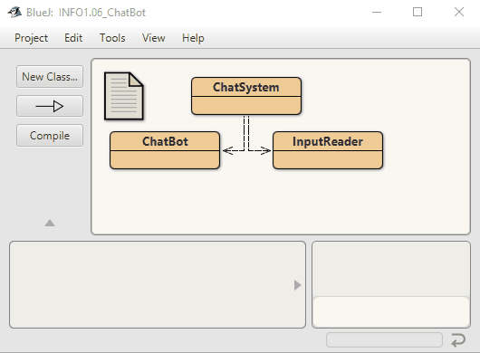

This project aims to implements a chat system for customers of 
the Talk-A-Lot software company. Users can describe their 
problems and get advice instantly!

The purpose of this project is to demonstrate and study library classes,
such as ArrayList, HashMap, HashSet, and Random.

This project is only a first, rudimentary step towards the full solution.
For the bored tasks have not been done here!

Based on the original by David J. Barnes and Michael Kölling
@author ruthWenzel & n-c0de-r
@version 2023.02.06

